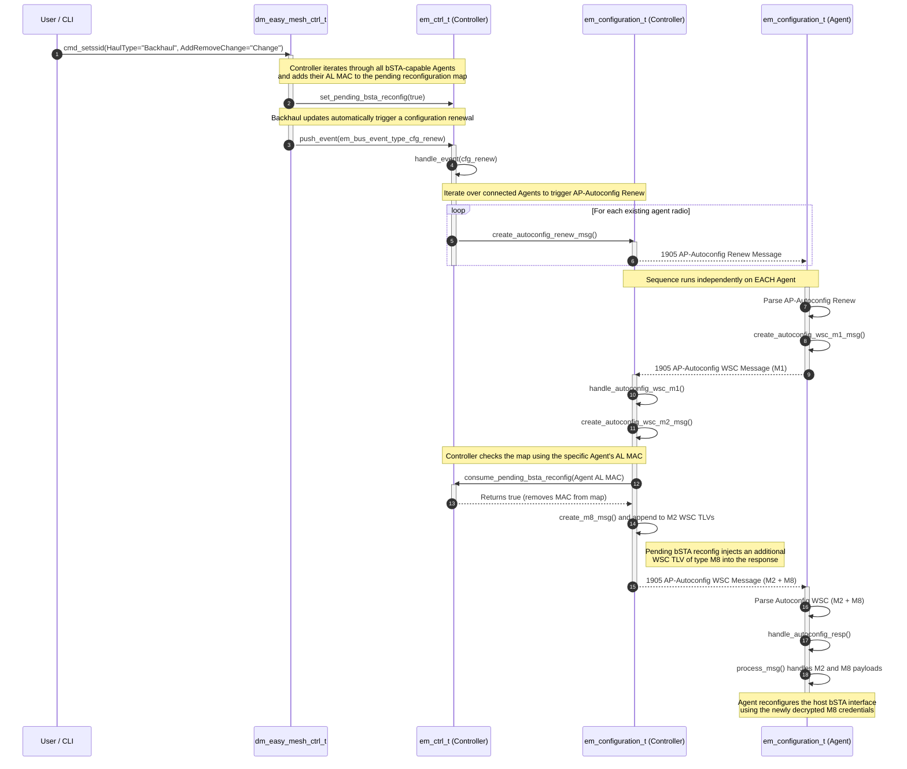

```mermaid
sequenceDiagram
    autonumber
    
    participant CLI as User / CLI
    participant DM as dm_easy_mesh_ctrl_t
    participant CTRL as em_ctrl_t (Controller)
    participant C_CONF as em_configuration_t (Controller)
    participant A_CONF as em_configuration_t (Agent)

    %% Trigger from external/CLI
    CLI->>DM: cmd_setssid(HaulType="Backhaul", AddRemoveChange="Change")
    
    %% Mark pending
    activate DM
    Note over DM, CTRL: Controller iterates through all bSTA-capable Agents<br/>and adds their AL MAC to the pending reconfiguration map
    DM->>CTRL: set_pending_bsta_reconfig(true)
    
    %% Native set_ssid behavior triggers a renew on backhaul updates
    Note over DM, CTRL: Backhaul updates automatically trigger a configuration renewal
    DM->>CTRL: push_event(em_bus_event_type_cfg_renew)
    deactivate DM
    
    %% Orchestrator processing of Renew
    activate CTRL
    CTRL->>CTRL: handle_event(cfg_renew)
    Note over CTRL, C_CONF: Iterate over connected Agents to trigger AP-Autoconfig Renew
    
    loop For each existing agent radio
        CTRL->>C_CONF: create_autoconfig_renew_msg()
        activate C_CONF
        C_CONF-->>A_CONF: 1905 AP-Autoconfig Renew Message
        deactivate C_CONF
    end
    deactivate CTRL

    %% Agent processing flow
    Note over A_CONF, C_CONF: Sequence runs independently on EACH Agent
    
    activate A_CONF
    A_CONF->>A_CONF: Parse AP-Autoconfig Renew
    A_CONF->>A_CONF: create_autoconfig_wsc_m1_msg()
    A_CONF-->>C_CONF: 1905 AP-Autoconfig WSC Message (M1)
    deactivate A_CONF
    
    %% Controller processes M1 and injects M8
    activate C_CONF
    C_CONF->>C_CONF: handle_autoconfig_wsc_m1()
    C_CONF->>C_CONF: create_autoconfig_wsc_m2_msg()
    
    Note over C_CONF, CTRL: Controller checks the map using the specific Agent's AL MAC
    C_CONF->>CTRL: consume_pending_bsta_reconfig(Agent AL MAC)
    activate CTRL
    CTRL-->>C_CONF: Returns true (removes MAC from map)
    deactivate CTRL
    
    C_CONF->>C_CONF: create_m8_msg() and append to M2 WSC TLVs
    Note right of C_CONF: Pending bSTA reconfig injects an additional<br/>WSC TLV of type M8 into the response
    C_CONF-->>A_CONF: 1905 AP-Autoconfig WSC Message (M2 + M8)
    deactivate C_CONF
    
    %% Agent receives the payload
    activate A_CONF
    A_CONF->>A_CONF: Parse Autoconfig WSC (M2 + M8)
    A_CONF->>A_CONF: handle_autoconfig_resp()
    A_CONF->>A_CONF: process_msg() handles M2 and M8 payloads
    Note over A_CONF: Agent reconfigures the host bSTA interface<br/>using the newly decrypted M8 credentials
    deactivate A_CONF
```
